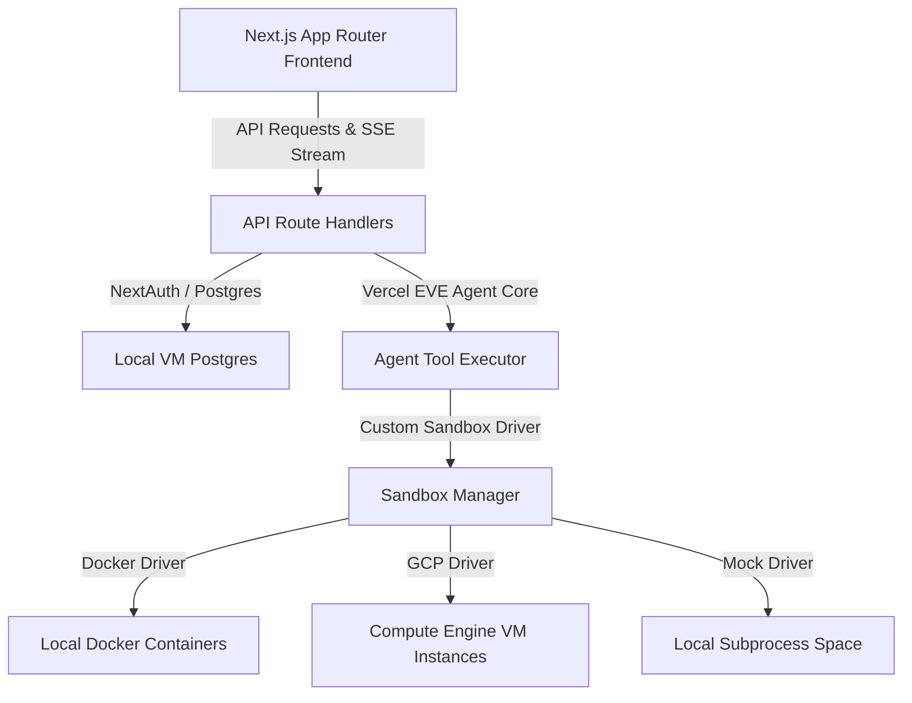

#  gcp-computer

A unified, secure, lightning-fast sandboxing platform for AI coding agents. Provision isolated workspaces in milliseconds, allowing agents to execute shell commands, edit files, and mount host directories safely.

Built with **Next.js App Router**, **Vercel EVE Agent Core**, **NextAuth.js**, and **Tailwind CSS v4**.

---

## Technical Architecture

The platform is designed around a modular, unified structure:



### Components

1. **Next.js App Router Frontend:** A premium dark-mode developer dashboard with glassmorphism layout, collapsible left sidebar (chat history), center stage agent chat terminal (with live nested tool execution logs), and a right panel to manage volume mounts and execute commands directly in the sandbox.
2. **Vercel EVE Agent Core:** Handles multi-turn tool calling (using AI SDK v7 `stopWhen` stop conditions) and resolves reasoning loops.
3. **Database Layer:** Uses Postgres for sessions, chats, and messages.
4. **Sandbox Manager:** Implements inactivity reapers (hibernates environments after 10 minutes of idle time) and manages sandbox lifecycles.
5. **Sandbox Drivers:**
   - **Docker Driver:** Spawns lightweight Alpine containers and dynamically handles mounting requests.
   - **GCP Compute Engine Driver:** Interfaces with raw VM instances.
   - **Mock Driver:** Subprocess fallback for offline/local execution.

---

## GDG Newport Beach Hackathon - Getting Started

This project was built for the **GDG Newport Beach Google I/O Extended Hackathon**.

### Judging Criteria

| Category         | Description                               | High Score                                          | Low Score                                   |
| :--------------- | :---------------------------------------- | :-------------------------------------------------- | :------------------------------------------ |
| **Impact**       | Does it solve a real, meaningful problem? | Clear real-world use case with tangible value       | Vague problem or no clear user impact       |
| **Innovation**   | Is the idea creative or differentiated?   | Unique approach or fresh perspective                | Generic idea or common use case             |
| **Execution**    | How well was it built and structured?     | Working prototype, solid system design, clean types | Broken, incomplete, or messy implementation |
| **Use of AI**    | Is AI used in a meaningful way?           | AI is core to the solution and adds real value      | AI is superficial or unnecessary            |
| **Presentation** | How clearly is the idea communicated?     | Clear, compelling demo and explanation              | Confusing, unclear, or poorly explained     |

---

## Local Development & Setup

### Prerequisites

- **Node.js (v22+)** and **npm**
- **Docker** (Optional - only needed for the Docker sandbox driver)

### Running the App

1. **Install Dependencies:**
   ```bash
   npm install
   ```
2. **Environment Variables:**
   Copy `.env.example` to `.env` and set local emulation mode:
   ```env
   APP_MODE=local-emulated
   NEXTAUTH_SECRET=a-secure-random-secret
   NEXTAUTH_URL=http://localhost:3000
   ```
3. **Start the Development Server:**
   ```bash
   npm run dev
   ```
4. Open [http://localhost:3000](http://localhost:3000) to view the application.

### Local Emulation Demo

- Google login is hidden.
- Credentials login works without Google Cloud setup.
- Sandboxes run in the in-memory emulator instead of the host OS.
- The agent falls back to a deterministic demo response when Gemini is unavailable.

### Live Demo

- http://8.229.141.54/ (GCP VM Hosting)

### Deploying

- The primary deployment path is Google Cloud Platform (GCP) Compute Engine:
  - Infrastructure Provisioning: [scripts/gcp-provision.ps1](file:///c:/Users/ethan/Documents/GitHub/gcp-computer/scripts/gcp-provision.ps1)
  - VM Provisioning Script: [scripts/vm-setup.sh](file:///c:/Users/ethan/Documents/GitHub/gcp-computer/scripts/vm-setup.sh)
  - Deployment Script: [scripts/vm-deploy.sh](file:///c:/Users/ethan/Documents/GitHub/gcp-computer/scripts/vm-deploy.sh)
  - GitHub Actions Workflow: [.github/workflows/deploy.yml](file:///c:/Users/ethan/Documents/GitHub/gcp-computer/.github/workflows/deploy.yml)
- Legacy Vercel guide: [docs/vercel-deployment-guide.md](file:///c:/Users/ethan/Documents/GitHub/gcp-computer/docs/vercel-deployment-guide.md)

Smoke test checklist: [docs/local-emulation-checklist.md](docs/local-emulation-checklist.md)

---

## Local Emulation Mode

Set `APP_MODE=local-emulated` to enable the localhost fallback path. In this mode the app uses developer credentials auth, the emulated sandbox provider, and the deterministic agent fallback.
