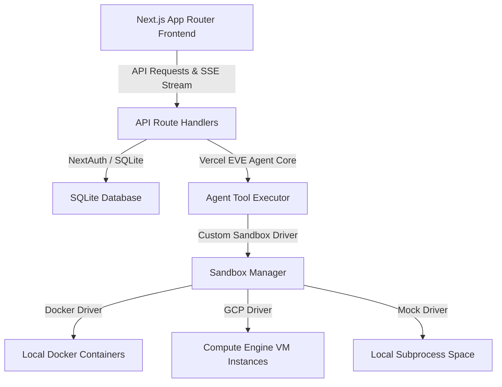

#  gcp-computer

A unified, secure, lightning-fast sandboxing platform for AI coding agents. Provision isolated workspaces in milliseconds, allowing agents to execute shell commands, edit files, and mount host directories safely.

Built with **Next.js App Router**, **Vercel EVE Agent Core**, **NextAuth.js**, and **Tailwind CSS v4**.

---

## Technical Architecture

The platform is designed around a modular, unified structure:



### Components
1. **Next.js App Router Frontend:** A premium dark-mode developer dashboard with glassmorphism layout, collapsible left sidebar (chat history), center stage agent chat terminal (with live nested tool execution logs), and a right panel to manage volume mounts and execute commands directly in the sandbox.
2. **Vercel EVE Agent Core:** Handles multi-turn tool calling (using AI SDK v7 `stopWhen` stop conditions) and resolves reasoning loops.
3. **Database Layer:** Uses Node 22's native `node:sqlite` for lightweight database tracking of sessions, chats, and messages with zero binary compilation overhead.
4. **Sandbox Manager:** Implements inactivity reapers (hibernates environments after 10 minutes of idle time) and manages sandbox lifecycles.
5. **Sandbox Drivers:**
   * **Docker Driver:** Spawns lightweight Alpine containers and dynamically handles mounting requests.
   * **GCP Compute Engine Driver:** Interfaces with raw VM instances.
   * **Mock Driver:** Subprocess fallback for offline/local execution.

---

## GDG Newport Beach Hackathon - Getting Started

This project was built for the **GDG Newport Beach Google I/O Extended Hackathon**.

### Judging Criteria

| Category | Description | High Score | Low Score |
| :--- | :--- | :--- | :--- |
| **Impact** | Does it solve a real, meaningful problem? | Clear real-world use case with tangible value | Vague problem or no clear user impact |
| **Innovation** | Is the idea creative or differentiated? | Unique approach or fresh perspective | Generic idea or common use case |
| **Execution** | How well was it built and structured? | Working prototype, solid system design, clean types | Broken, incomplete, or messy implementation |
| **Use of AI** | Is AI used in a meaningful way? | AI is core to the solution and adds real value | AI is superficial or unnecessary |
| **Presentation** | How clearly is the idea communicated? | Clear, compelling demo and explanation | Confusing, unclear, or poorly explained |

---

## Local Development & Setup

### Prerequisites
- **Node.js (v22+)** and **npm**
- **Docker** (Optional - falls back to Mock Driver if unavailable)

### Running the App
1. **Install Dependencies:**
   ```bash
   npm install
   ```
2. **Environment Variables:**
   Create a `.env` file in the root directory:
   ```env
    # Gemini API Credentials (required for AI features)
    GEMINI_API_KEY=your-gemini-api-key

    # Postgres for production/demo
    DATABASE_URL=postgresql://...

    # NextAuth Options
    NEXTAUTH_SECRET=a-secure-random-secret
    NEXTAUTH_URL=http://localhost:3000

    # Developer Mock Credentials Auth Fallback (enabled by default)
    ALLOW_MOCK_AUTH=true
    SANDBOX_PROVIDER=mock

    # Optional Google sign-in
    GOOGLE_CLIENT_ID=your-google-client-id
    GOOGLE_CLIENT_SECRET=your-google-client-secret
    ```
3. **Start the Development Server:**
   ```bash
   npm run dev
   ```
4. Open [http://localhost:3000](http://localhost:3000) to view the application.

---

## Architectural Proposal: Vercel Emulate & just-bash

To optimize local development loops and remove dependency bottlenecks (such as needing real GCP accounts or local Docker installation), we propose integrating the following:

### 1. Google OAuth Emulation with `vercel-labs/emulate`
- **Use Case:** Stateful, production-fidelity mock of Google Authentication APIs.
- **Benefit:** Allows developers to test full OAuth redirection and session creation loops locally and in CI environments without needing to configure Google Cloud Console OAuth consent screens or maintain credentials.

### 2. In-Memory Sandboxing with `vercel-labs/just-bash`
- **Use Case:** A fully sandboxed Bash interpreter written in TypeScript running in an in-memory virtual filesystem.
- **Benefit:** Instead of using the `MockSandboxProvider` (which executes commands on the developer's physical host machine using subprocesses), `just-bash` can execute shell utilities (`ls`, `cat`, `grep`, `awk`) inside a secure, JavaScript-isolated virtual space. This enables secure local sandboxing on machines without Docker.
