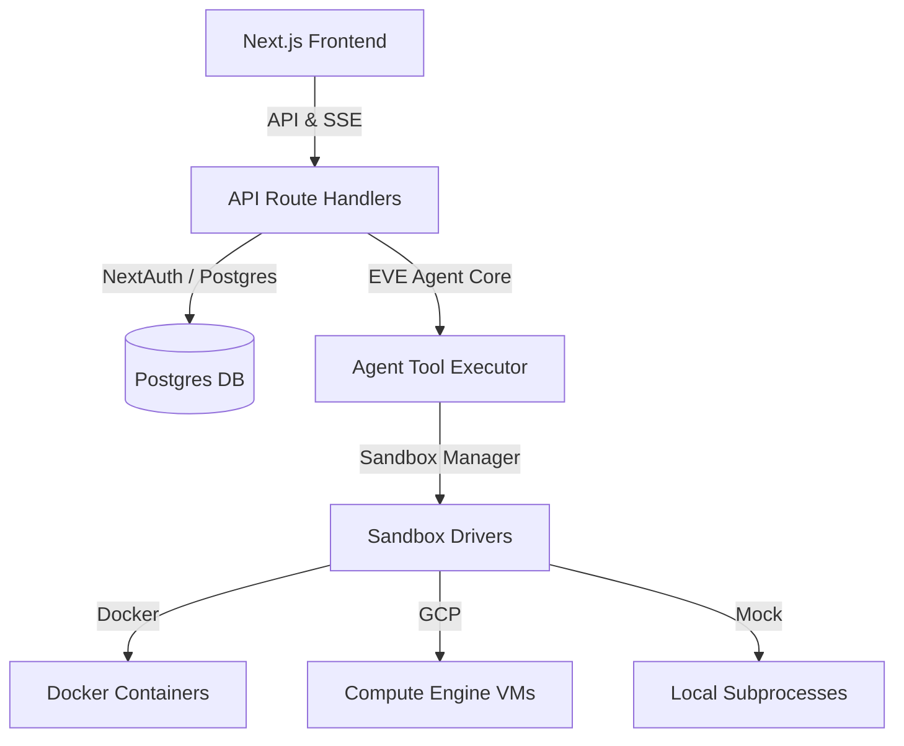

import { Terminal, Cloud, Cpu, Lock, Zap, BookOpen } from 'lucide-react';

# GCP Computer Documentation

A unified, secure, lightning-fast sandboxing platform for AI coding agents. Provision isolated workspaces in milliseconds, allowing agents to execute shell commands, edit files, and mount host directories safely.

  <Zap size={20} className="mb-3 text-[var(--color-lavender)]" />
  <h3 className="mb-1 text-sm font-semibold">Lightning Fast</h3>
  
Provision sandboxes in milliseconds, not minutes.

  <Lock size={20} className="mb-3 text-[var(--color-lavender)]" />
  <h3 className="mb-1 text-sm font-semibold">Secure by Default</h3>
  
Isolated environments for every agent session.

  <Cloud size={20} className="mb-3 text-[var(--color-lavender)]" />
  <h3 className="mb-1 text-sm font-semibold">GCP Native</h3>
  
Runs on Google Cloud Compute Engine.

  <Cpu size={20} className="mb-3 text-[var(--color-lavender)]" />
  <h3 className="mb-1 text-sm font-semibold">Multiple Drivers</h3>
  
Docker, GCP VMs, or local emulation.

  <Terminal size={20} className="mb-3 text-[var(--color-lavender)]" />
  <h3 className="mb-1 text-sm font-semibold">Agent-Ready</h3>
  
Built for AI agents with full tool execution.

  <BookOpen size={20} className="mb-3 text-[var(--color-lavender)]" />
  <h3 className="mb-1 text-sm font-semibold">Open Source</h3>
  
Built for the GDG Newport Beach Hackathon.

## Quick Start

Get GCP Computer running locally in under 5 minutes:

1. **Clone the repo** and install dependencies with `npm install`
2. **Copy `.env.example` to `.env`** and set `APP_MODE=local-emulated`
3. **Start the dev server** with `npm run dev`
4. **Open http://localhost:3000** and sign in

For detailed instructions, head to the [Getting Started](/docs/getting-started) guide.

---

## Architecture Overview

## Navigation

<a href="/docs/getting-started" className="gcp-card-dark group rounded-lg p-5 transition-all hover:border-[var(--color-lavender)]/30">
  Getting Started &rarr;
  
Set up GCP Computer from scratch.

</a>

<a href="/docs/installation" className="gcp-card-dark group rounded-lg p-5 transition-all hover:border-[var(--color-lavender)]/30">
  Installation &rarr;
  
Detailed install options and environment config.

</a>

<a href="/docs/development" className="gcp-card-dark group rounded-lg p-5 transition-all hover:border-[var(--color-lavender)]/30">
  Local Development &rarr;
  
Run with emulated sandboxes for offline demo.

</a>

<a href="/docs/deployment" className="gcp-card-dark group rounded-lg p-5 transition-all hover:border-[var(--color-lavender)]/30">
  Deployment &rarr;
  
Deploy to Google Cloud Platform.

</a>

